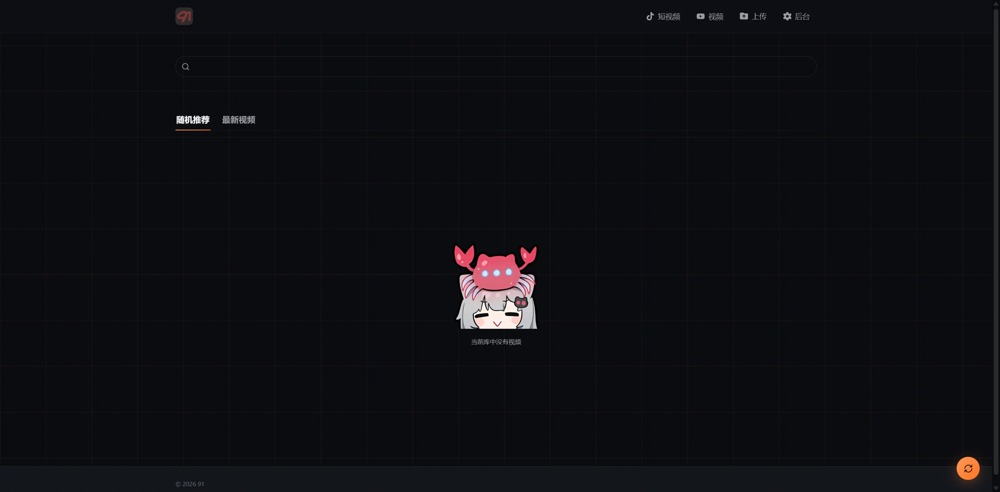
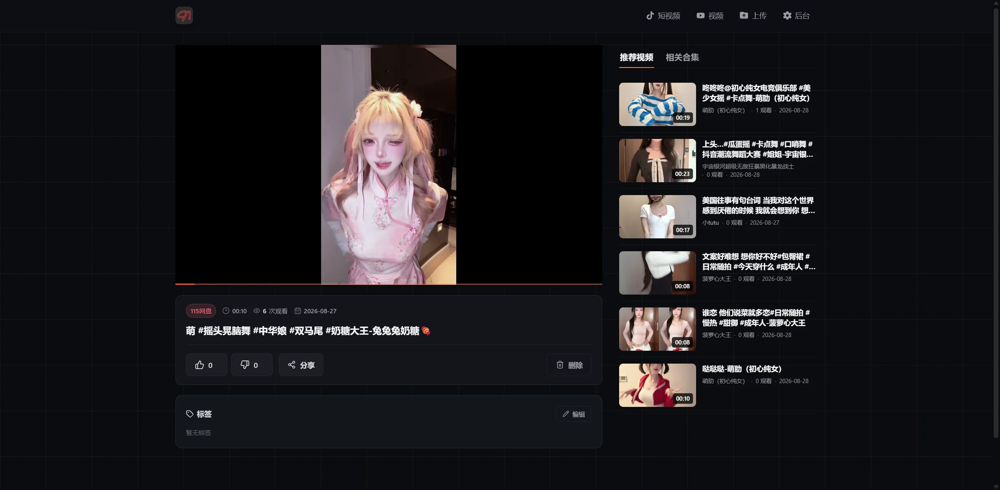
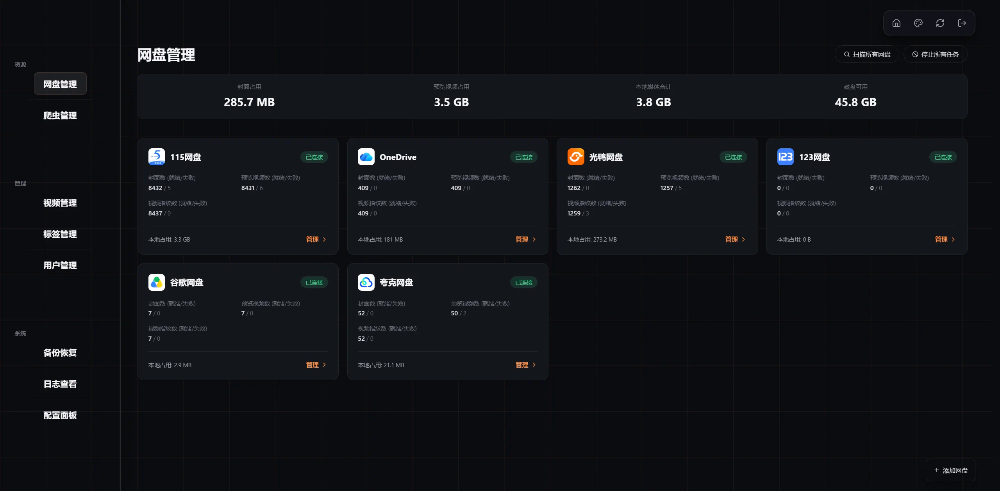
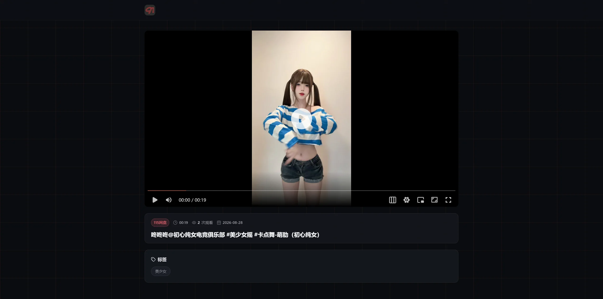

<p align="center">
  
</p>

<p align="center">
  😄 个人私有视频站 😄
</p>

## 功能特性

- **多网盘接入** — 支持115、PikPak、123网盘、联通网盘、光鸭网盘、夸克云盘、OneDrive、Google Drive、WebDAV 和本地存储
- **低带宽播放** — 115 云盘、PikPak 云盘、123网盘、联通网盘、光鸭网盘、OneDrive 支持302模式，在线播放视频时，不占用服务器带宽；WebDAV 会遵循上游响应，返回3xx时由浏览器直连，返回200/206（例如 OpenList Crypt）时由服务器中转；Google Drive 走服务器中转
- **云盘 Crypt 与独立代理** — 115、PikPak、123、联通、光鸭、夸克、OneDrive、Google Drive 和 WebDAV 均可按 OpenList / rclone Crypt 配置透明加解密，并可为每个云盘单独设置 HTTP(S) 或 SOCKS 代理
- **短视频模式** — 一键切换抖音风格，沉浸刷片
- **视频分享** — 视频支持一次性分享，"看完即焚"
- **爬虫脚本** — 支持导入自定义脚本，但是有一些规范，具体可以参考 [SpiderFor91](https://github.com/Just-Spider/SpiderFor91)

## 云盘 Crypt 与代理

在后台的“网盘管理”中新增或编辑 115、PikPak、123、联通、光鸭、夸克、OneDrive、Google Drive 或 WebDAV 时，可以按需配置以下功能：

- 启用 **Crypt** 后，填写与 OpenList 或 rclone Crypt 相同的密码、可选 salt、文件名加密方式、目录名加密、文件名编码及加密后缀。已有 Crypt 目录可以被扫描并播放；上传到该网盘的文件会在服务端加密后再写入对应云盘。
- 每个云盘可单独配置代理地址，支持 `http://`、`https://`、`socks5://` 和 `socks5h://`，例如 `http://127.0.0.1:7890` 或 `socks5://127.0.0.1:1080`。代理设置只作用于当前云盘，不会影响其他网盘。

未启用 Crypt 时，表单只显示代理地址和“启用 Crypt”开关；开启后才显示密码及其他 Crypt 参数，且必须填写 Crypt 密码。

请妥善保管 Crypt 密码和 salt；它们是读取已加密文件所必需的配置。

## `.strm` 文件支持

本地存储和 WebDAV 均可将 `.strm` 文件作为视频来源。本地存储支持相对路径、绝对路径和 HTTP(S) 地址；WebDAV 支持相对路径、绝对路径，以及同一 WebDAV 端点的完整 HTTP(S) 地址。

- 默认只允许 `.strm` 指向当前网盘根目录内的文件。确有跨目录需求时，可在网盘编辑页启用“`.strm` 允许指向 WebDAV 根目录外”；本地存储对应的选项为“`.strm` 允许指向目录外”。
- 同一 WebDAV 端点的完整 URL 会按 WebDAV 路径处理，继续使用当前网盘的认证信息；因此可用于 OpenList 挂载中位于扫描根目录外的文件。
- 其他 HTTP(S) 地址，以及带查询参数、片段或 URL 用户信息的地址，会作为外部链接处理，系统不会向目标发送 WebDAV 账号密码。
- WebDAV/OpenList 目标若会重定向到 115 等限制并发下载的上游，预览视频会逐段串行生成，并在每段前重新获取链接。生成速度会略慢，但可避免多段并发读取导致的 `403 access denied`；直接使用 Cookie 配置的 115 仍会串行生成，并只在读取或签名链接失败后刷新。

## 预览图




## 快速开始

### Docker Compose 部署

Docker Compose 会使用仓库内的 `Dockerfile` 在本机构建镜像，不依赖预构建镜像。

**1. 获取源码**

```bash
git clone https://github.com/Guciliang/91.git video-site-91
cd video-site-91
```

**2. 构建并启动**

```bash
docker compose up -d --build
```
**常用命令：**
```bash
docker compose logs -f             # 查看日志
docker compose up -d --build       # 重新构建并启动
docker compose build --no-cache    # 完全重新构建
```

部署完成后访问：`http://服务器IP:9191/`

> 所有配置、数据库、封面、预览及上传文件均保存在 `./data/` 目录下。
> 更新源码后执行 `git pull && docker compose up -d --build`；`./data/` 不会被构建或容器更新覆盖。

## 数据存放位置

| 路径 | 内容 |
|------|------|
| `./data/config.yaml` | 配置文件、管理员账号、网盘凭证 |
| `./data/video-site.db` | SQLite 数据库 |
| `./data/previews/` | 封面图和预览片段 |

## 其他说明

### 短视频模式
> ios设备不建议使用短视频模式

### 分享链接
> 视频支持生成分享链接，链接只能打开一次，链接分享的视频无需登录即可播放



### 三屏画面
> 只有竖屏视频支持三屏画面，只有电脑端支持三屏画面，三屏画面播放视频走的是服务器代理

<table>
  <tr>
    <td width="50%"></td>
    <td width="50%"></td>
  </tr>
  <tr>
    <td align="center">单屏画面</td>
    <td align="center">三屏画面</td>
  </tr>
</table>

## 使用须知

- **本项目仅面向个人私有部署**
- **请遵守法律**

## 致谢

- [Cli-Proxy-API-Management-Center](https://github.com/router-for-me/Cli-Proxy-API-Management-Center) — 参考其页面设计
- [ArtPlayer](https://github.com/zhw2590582/ArtPlayer) — 当前项目使用的视频播放器
- [OpenList](https://github.com/OpenListTeam/OpenList) — 优秀的开源项目
- [LinuxDo](https://linux.do/) — 学 AI 上 L 站
- [NodeSeek](https://nodeseek.com/) — MJJ 上 N 站

## 捐赠

如果这个项目对你有帮助，欢迎请我喝杯咖啡。

<table>
  <tr>
    <td width="50%"></td>
    <td width="50%"></td>
  </tr>
  <tr>
    <td align="center">微信</td>
    <td align="center">支付宝</td>
  </tr>
</table>
